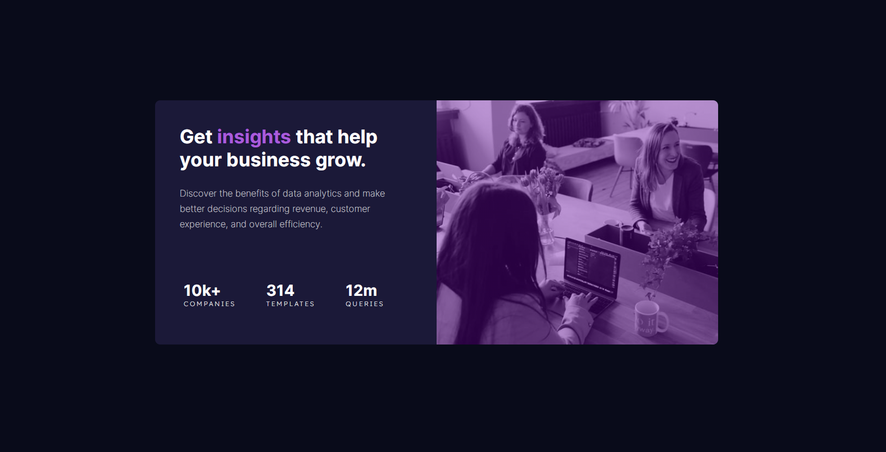

  

  <h2 align="center">Stats Preview Card Component Solution</h2>
  

    <a href="https://www.frontendmentor.io/challenges/stats-preview-card-component-8JqbgoU62" target="_blank"><strong>Frontend Mentor Challenge</strong></a>
     
     
    <a href="https://luccasfaro.github.io/stats-preview-card-component/" target="_blank">View Site</a>
    &nbsp;·&nbsp;
    <a href="https://github.com/luccasfaro/stats-preview-card-component/issues" target="_blank">Report Bug</a>
    &nbsp;·&nbsp;
    <a href="https://github.com/luccasfaro/stats-preview-card-component/issues" target="_blank">Request Feature</a>
  

<!-- Badges -->

  <!-- Profiles -->
   &nbsp;&nbsp;&nbsp;

  <!-- Status -->
   &nbsp;&nbsp;&nbsp;

  <!-- Difficulty -->
  

 
 

## **Preview**

 

## **Links**

- |||
  | :----- | :----- |
  | Solution URL: | [Responsive card made using flex-box properties (HTML/CSS)](https://www.frontendmentor.io/solutions/responsive-card-made-using-flexbox-properties-htmlcss-A4PNl4i5sV) |
  | Live Site URL: | [https://luccasfaro.github.io/stats-preview-card-component/](https://luccasfaro.github.io/stats-preview-card-component/) |
  |||

## The challenge

- The challenge is to build out this card component and get it looking as close to the design as possible.

- Your users should be able to: 
  - View the optimal layout depending on their device's screen size

 

## **Built With**

  &nbsp;  

 

## **Tools Used**

 &nbsp;

 

## **Acknowledgment**

* Challenge was provided by [Frontend Mentor](https://www.frontendmentor.io)
* Readme Template based on [0xabdulkhalid](https://github.com/0xabdulkhalid/3-column-preview-card-component/blob/main/README.md)

 

## **Let's Connect 👋**

<!--   &nbsp;&nbsp;&nbsp; -->

   &nbsp;&nbsp;&nbsp;

  

 
